基于Springboot的社团服务系统（程序+论文）
=

### 完整代码获取地址：从戎源码网 ([https://armycodes.com/](https://armycodes.com/))
### 作者微信：19941326836  QQ：952045282 
### 承接计算机毕业设计、Java毕业设计、Python毕业设计、深度学习、机器学习
### 选题+开题报告+任务书+程序定制+安装调试+论文+答辩ppt 一条龙服务
### 所有选题地址https://github.com/nature924/allProject

一、项目介绍
---

基于 Spring Boot + Vue 的社团服务系统，面向“管理员 / 学生 / 社团人员”三类角色，已实现的主要功能如下：

系统角色
管理员（系统后台管理）
账户管理：登录、修改密码、获取/修改个人信息、重置用户密码
内容管理：新闻公告、软件大全、网络套餐、装机咨询、网络报修 的增删改查（后台分页/筛选/详情/审核）
评论/回复管理：查看/删除评论、管理讨论区内容
收藏管理：查看与管理用户收藏（Storeup）

学生（前端用户）
账户操作：注册、登录、登出、重置密码
浏览与交互：查看新闻/软件/套餐/报修/咨询 列表与详情、发表评论、收藏、提交报修、发起咨询

社团人员（前端/部分管理权限）
账户操作同学生
内容发布与处理：发布/回复咨询、管理本社团相关条目（类似学生的增改查权限）

二、项目技术
---
- 编程语言：Java
- 数据库：MySQL
- 项目架构：B/S架构
- 前端技术：JSP
- 后端技术：Spring、SpringMVC、MyBatis

三、运行环境
---
- 操作系统：Windows、macOS都可以
- JDK版本：JDK1.8以上都可以
- 开发工具：IDEA、Ecplise、Myecplise都可以
- 数据库: MySQL5.7以上都可以
- Tomcat：任意版本都可以
- Maven：任意版本都可以

四、运行截图
---
### 论文截图：
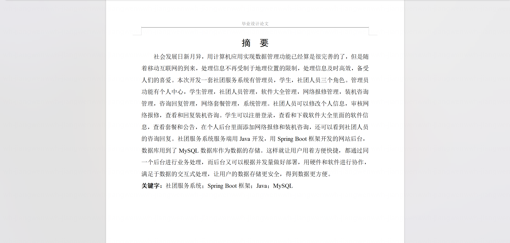
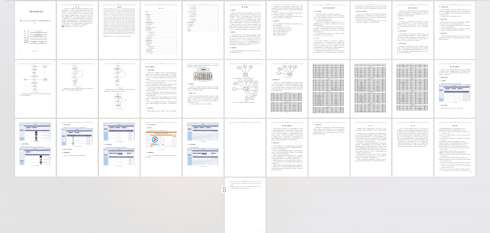

### 程序截图：
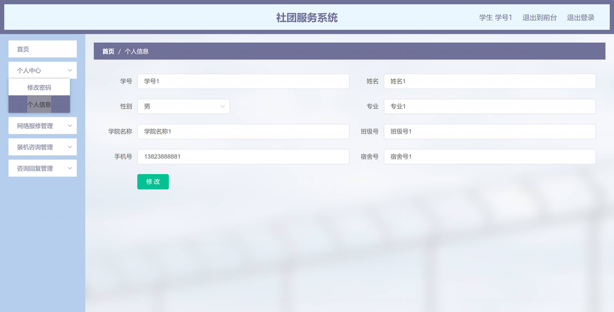
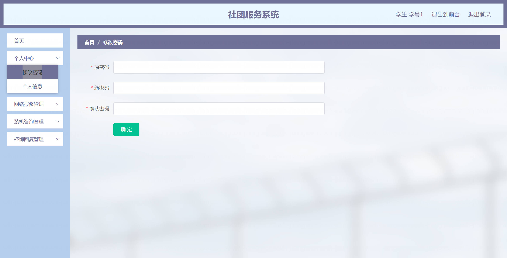
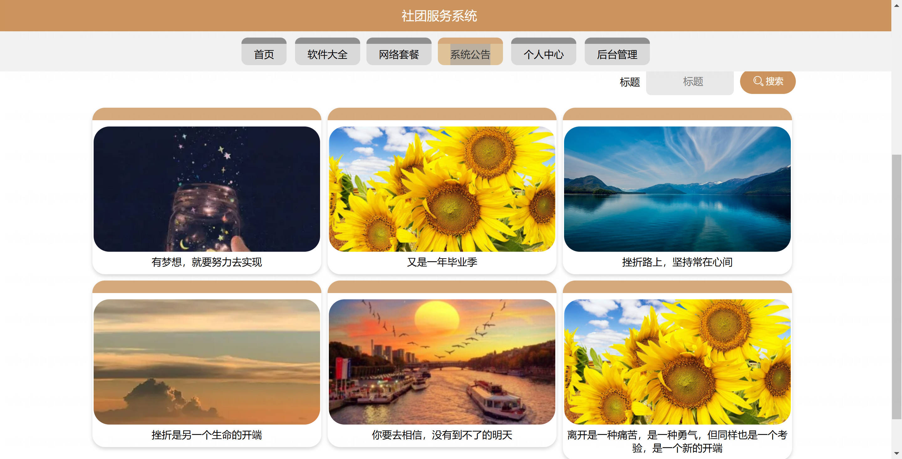
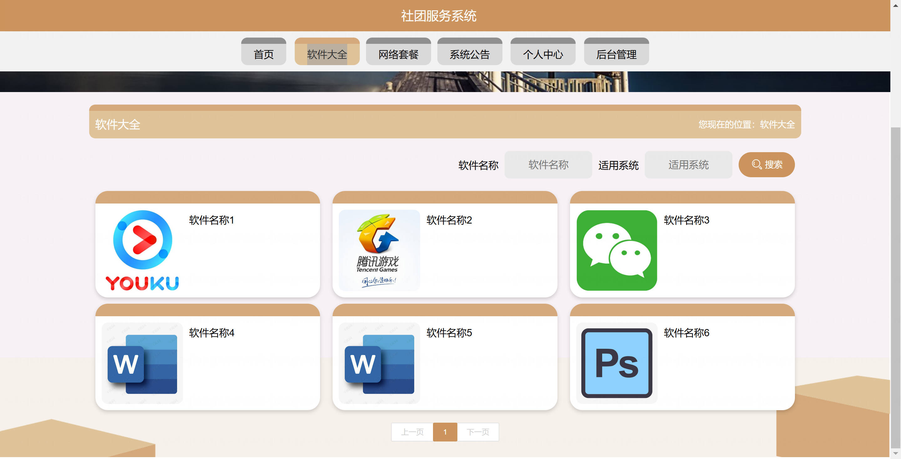
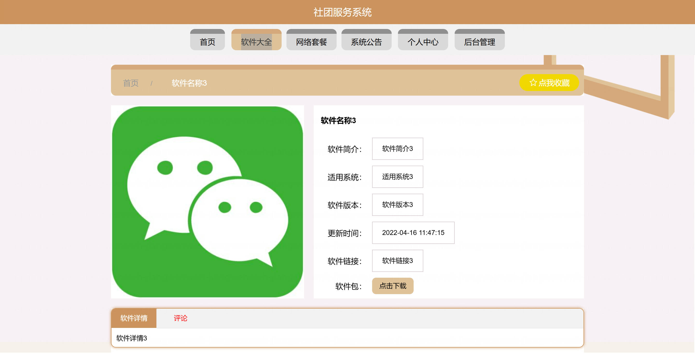
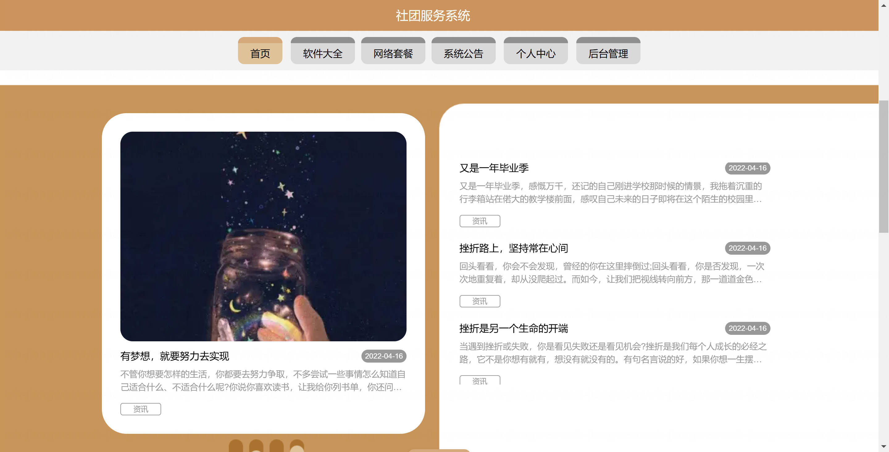
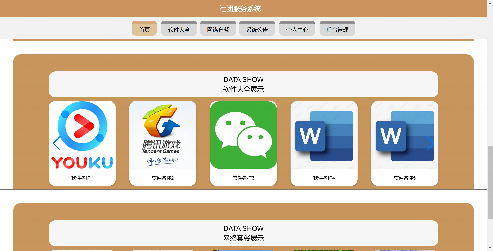
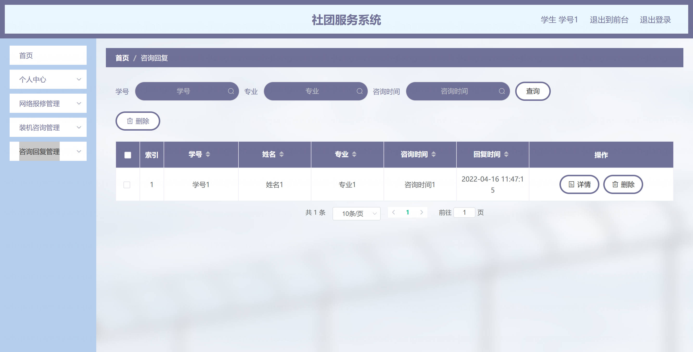
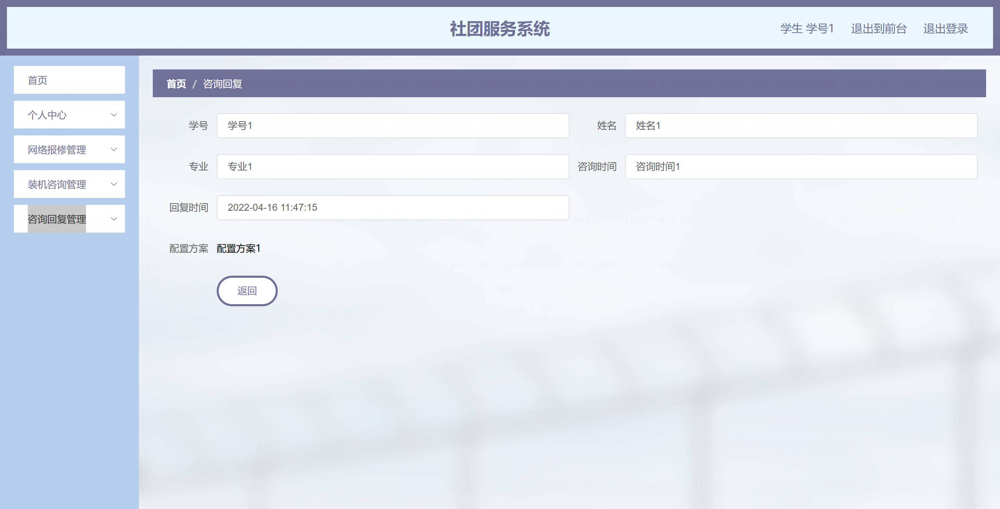

